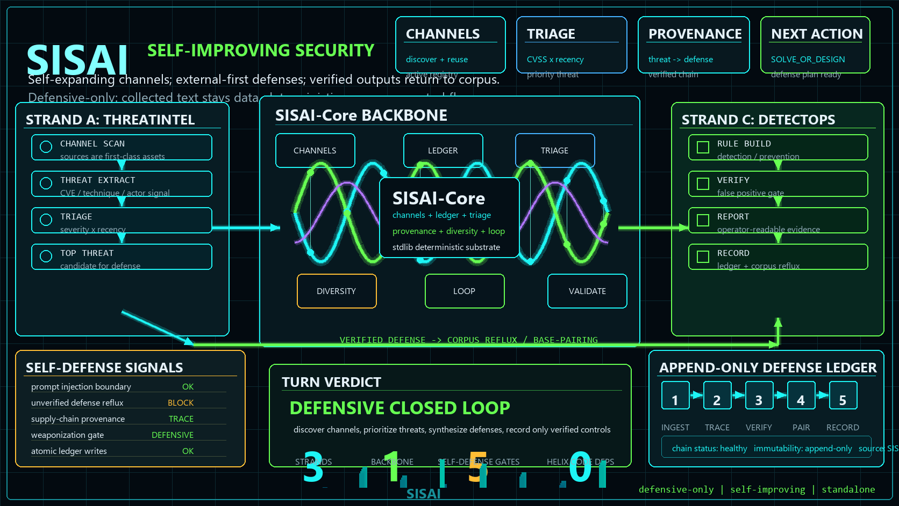

# SISAI — Self-improvement Security AI

> **A self-improving security AI that discovers and expands its own security/safety
> channels, collects hacking methods and cases, searches externally first for solutions
> → designs them itself with pgf when none exist, and compounds its detection/prevention
> defenses over time.**

SISAI lets **the system itself expand the channels** through which it obtains information,
and it **records and reuses** channels, threats, and defenses (single-source backbone). The
driving engine is the **AI runtime**, and as its notation/execution framework it **vendors**
`skills/{pg,pgf,pgxf}` **inside the project** so it runs **self-contained from the SISAI
folder alone**. It inherits HELIX's explore⊕exploit spiral *pattern* but has **zero code
dependency — fully independent of HELIX**.

## Three strands (3 strands) + backbone

<p align="center">
  
</p>

<details><summary>Same diagram (text)</summary>

```
   Strand A (ThreatIntel)      Strand B (DefenseSynth)       Strand C (DetectOps)
   channel scan → threat       external search → design       detection-rule/report
   collection                  itself if none found           operations
        \                          |                          /
         \        backbone (core/) — single-source deterministic substrate     /
          \  channels·ledger·diversity·triage·provenance·loop /
   verified defenses → corpus feedback (base pairs) → next turn compounds into synthesizing better defenses (non-converging spiral)
```

</details>

- **Channels are first-class assets**: discover → ledger → reuse. Not a fixed list.
- **External first → design itself**: solutions are searched first in the external corpus, and if none exist they are built with the pgf full-cycle.
- **triage**: decides *what to block first* by CVSS × recency (a security-specific dimension).
- **diversity**: watches for *blind spots* via attack-surface coverage.

## Deterministic boundary (= first-line injection defense)

- **`core/` = pure determinism**: stdlib only, no clock/network/AI/randomness (`now` injected).
  **Collected external text cannot change core's control flow** → first-line prompt-injection blocking.
- **AI meta-layer** = actual channel discovery, threat understanding, defense design (skills/AI runtime). Outside core.
- **defensive-only**: outputs are detection/prevention/reports. Weaponizing working exploits or automating targeted attacks is **out of scope**.

## Quick start

```bash
# One-turn status (read) — channels/threats/triage/defense-plan/next-action
python sisai.py status --now 2026-06-17

# Defense procurement strategy for the top-priority threat (external first / design itself if none)
python sisai.py plan --now 2026-06-17

# Discover and record a new channel (reuse — idempotent)
python sisai.py discover-channel --channel ch.json --registry .sisai/channels.json

# ★ Close the loop: record a verified defense to the ledger + corpus feedback (base pairs). idempotent.
python sisai.py record-defense --defense def.json --ledger .sisai/ledger.json --corpus .sisai/corpus.json

# RUN_THREAT_INTEL: load newly scanned threats (schema validation · dedup · data-only). idempotent.
python sisai.py ingest-threats --threats new_threats.json --ledger .sisai/ledger.json

# Structure/contract validation / batch defense-layer validation / tests
python core/sisai_validate.py .                       # structure + seed contract
python core/sisai_validate.py . --integrity --live    # skill integrity + .sisai runtime state
python defenses/verify_all.py                         # batch of 10 defense suites (recall/precision summary)
python -m unittest discover -s tests -q
```

> **Status**: DefenseSweep complete — all 10 seed threats defended (ledger feedback), 9 channels (no missing kinds).
> The next step is `RUN_THREAT_INTEL` (collect new threats → load with `ingest-threats`).

## Structure

```
SISAI/
├── sisai.py            # driver (status / plan / discover-channel / record-defense)
├── core/               # ★ backbone (stdlib, deterministic) — HELIX-independent
│   ├── sisai_fingerprint.py  # channel/threat/defense identity fingerprints
│   ├── sisai_channels.py     # ★ channel registry — discover·record·reuse (self-expanding)
│   ├── sisai_ledger.py       # threat/defense reuse gate
│   ├── sisai_triage.py       # severity×recency priority + coverage (blind spots)
│   ├── sisai_provenance.py   # threat→defense lineage + verified-defense→corpus feedback
│   ├── sisai_loop.py         # next_action (3 strands) + plan_defense (external first)
│   ├── sisai_io.py           # atomic crash-safe writes
│   ├── sisai_schema.py       # JSON-Schema-subset contract checker
│   ├── sisai_validate.py     # structure/contract validation
│   ├── sisai_detect.py       # v1.4: inert hygiene, rule compile/scan, blue_run, atomic_append_samples (holdout freeze)
│   └── sisai_verify.py       # v1.4: split-aware verify_suite (frozen holdout) + roles_disjoint (cross-model)
├── engines/            # adapters.py (backbone projection) · adversarial.py (v1.4 red/blue loop + author routing)
├── tools/              # PoC CLIs (edge): detect_pr · policy_compile · control_drift · benchmark_harness · prompt_shield · audit_export · soc_cluster · toolchain_sentinel
├── labs/               # education pack (defense_rule_lab — grade student rules on the frozen holdout)
├── calibration/        # cross-model scoring · battery · robustness · independence protocol
├── regtech/ · domain/  # B2 domain packs (DRAFT/synthetic: RegTech · fraud_aml · trust_safety · pharmacovigilance)
├── skills/{pg,pgf,pgxf}# vendored — AI-runtime driving engines (self-contained)
├── schemas/            # 7 contracts (channel/threat/defense/ledger/loop-state + v1.4: sample/role-registry)
├── seed/               # seed corpus (channels/threats/defenses + v1.4: sample-suite/role-registry examples)
├── docs/               # TECHNICAL-GUIDE · TOOLS-CATALOG · ARCHITECTURE · SELF-DEFENSE · INSTRUCTIONS · RUNBOOK
├── examples/           # sample state
└── tests/              # deterministic unittest (232)
```

## See more
**Start here:** `docs/TECHNICAL-GUIDE.md` (complete standalone technical reference — understand & operate SISAI from one doc). ·
`docs/TOOLS-CATALOG.md` (the B0–B2 detection/evidence PoC fleet built on the backbone) ·
`HANDOFF.md` (what shipped beyond the backbone + honest gaps + next work) ·
`RUNBOOK.md` (all-feature invocation) · `docs/ARCHITECTURE.md` (3 strands ↔ implementation) ·
`docs/SELF-DEFENSE.md` (SISAI self-defense) · `docs/INSTRUCTIONS-sisai-cycle.md` (one autonomous turn reading docs only).

## License
[MIT](LICENSE) © 2026 Jung Wook Yang.

> **Intent**: To **search for and prevent AI-abused hacking and security/safety breaches and to bring safety/security forward**,
> this is released under MIT so anyone can freely use and contribute. This software is **defensive-only**
> — its purpose is detection/prevention/reports, and weaponization (working exploits · automated targeted attacks · detection evasion) is out of scope.
