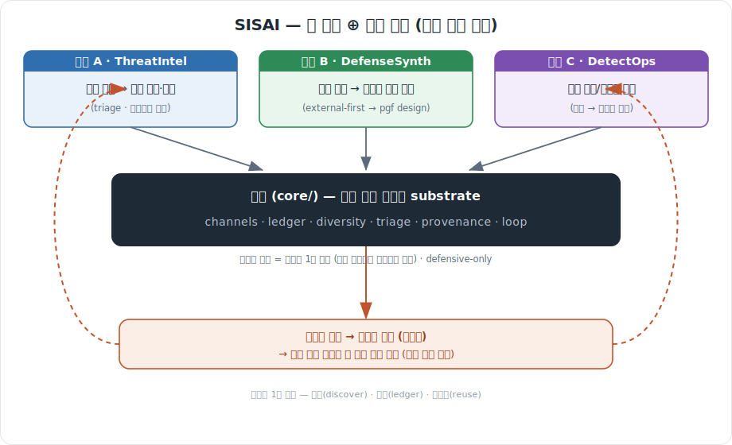

# SISAI — Self-improvement Security AI

> **보안/안전 채널을 스스로 발굴·확장하며 해킹 방법·사례를 수집하고,
> 해결책을 외부에서 우선 탐색 → 없으면 pgf로 자체 설계해, 감지/방지 방어를
> 복리로 키워가는 자기개선 보안 AI.**

SISAI는 정보를 입수할 **채널 자체를 시스템이 확장**하고, 채널·위협·방어를 **기록하고
재사용**합니다(단일 출처 백본). 구동 엔진은 **AI 런타임**이며, 표기·실행 프레임워크로
`skills/{pg,pgf,pgxf}`를 **프로젝트 안에 vendor**해 **SISAI 폴더만으로 자기완결**로 돕니다.
HELIX의 explore⊕exploit 나선 *패턴*을 계승하되 **코드 의존은 0 — HELIX와 완전 독립**입니다.

## 세 가닥 (3 strands) + 백본

<p align="center">
  
</p>

<details><summary>같은 그림 (텍스트)</summary>

```
   가닥 A (ThreatIntel)        가닥 B (DefenseSynth)        가닥 C (DetectOps)
   채널 스캔 → 위협 수집        외부 탐색 → 없으면 자체설계      탐지 규칙/리포트 운영
        \                          |                          /
         \        백본(core/) — 단일 출처 결정론 substrate     /
          \  channels·ledger·diversity·triage·provenance·loop /
   검증된 방어 → 코퍼스 환류(염기쌍) → 다음 턴이 복리로 더 나은 방어 합성 (수렴 없는 나선)
```

</details>

- **채널은 1급 자산**: 발굴(discover) → 기록(ledger) → 재사용(reuse). 고정 목록이 아니다.
- **외부 우선 → 자체 설계**: 해결책은 외부 코퍼스에서 먼저 찾고, 없으면 pgf full-cycle로 만든다.
- **triage**: CVSS × 최신성으로 *무엇을 먼저 막을지* 결정 (보안 고유 차원).
- **diversity**: 공격표면 커버리지로 *사각지대(blind spot)* 를 감시.

## 결정론 경계 (= 1차 인젝션 방어)

- **`core/` = 순수 결정론**: stdlib only, 시계·네트워크·AI·난수 없음(`now` 주입).
  **수집한 외부 텍스트는 core의 제어 흐름을 바꿀 수 없다** → 프롬프트 인젝션 1차 차단.
- **AI 메타층** = 실제 채널 발견·위협 이해·방어 설계 (skills/AI 런타임). core 밖.
- **defensive-only**: 산출은 탐지/방지/리포트. 작동 익스플로잇 무기화·표적공격 자동화는 **범위 밖**.

## 빠른 시작

```bash
# 한 턴 상태 (읽기) — 채널/위협/triage/방어계획/다음액션
python sisai.py status --now 2026-06-17

# 최우선 위협의 방어 조달 전략 (외부 우선 / 없으면 자체설계)
python sisai.py plan --now 2026-06-17

# 새 채널 발굴·기록 (재사용 — idempotent)
python sisai.py discover-channel --channel ch.json --registry .sisai/channels.json

# ★ 고리 닫기: 검증된 방어를 ledger에 기록 + 코퍼스 환류(염기쌍). idempotent.
python sisai.py record-defense --defense def.json --ledger .sisai/ledger.json --corpus .sisai/corpus.json

# 구조·계약 검증 / 테스트
python core/sisai_validate.py .
python -m unittest discover -s tests -q
```

## 구조

```
SISAI/
├── sisai.py            # 드라이버 (status / plan / discover-channel / record-defense)
├── core/               # ★ 백본 (stdlib, 결정론) — HELIX 독립
│   ├── sisai_fingerprint.py  # 채널/위협/방어 식별 지문
│   ├── sisai_channels.py     # ★ 채널 레지스트리 — 발굴·기록·재사용 (자기확장)
│   ├── sisai_ledger.py       # 위협/방어 재사용 게이트
│   ├── sisai_triage.py       # severity×recency 우선순위 + 커버리지(사각지대)
│   ├── sisai_provenance.py   # 위협→방어 계보 + 검증방어→코퍼스 환류
│   ├── sisai_loop.py         # next_action(3가닥) + plan_defense(외부우선)
│   ├── sisai_io.py           # atomic crash-safe 쓰기
│   ├── sisai_schema.py       # JSON-Schema-subset 계약 검사기
│   └── sisai_validate.py     # 구조·계약 검증
├── engines/adapters.py # native 산출 → 백본 투영 (pure)
├── skills/{pg,pgf,pgxf}# vendored — AI 런타임 구동 엔진 (자기완결)
├── schemas/            # 계약 5종 (channel/threat/defense/ledger/loop-state)
├── seed/               # 시드 코퍼스 (요약.md → taxonomy/defense/channel)
├── docs/               # ARCHITECTURE · SELF-DEFENSE · INSTRUCTIONS · RUNBOOK
├── examples/           # 샘플 상태
└── tests/              # 결정론 unittest
```

## 더 보기
`RUNBOOK.md`(전 기능 호출) · `docs/ARCHITECTURE.md`(3가닥↔구현) ·
`docs/SELF-DEFENSE.md`(SISAI 자기방어) · `docs/INSTRUCTIONS-sisai-cycle.md`(문서만 읽고 자율 한 턴).

## 라이선스
방어 보안 연구·교육 목적. defensive-only.
